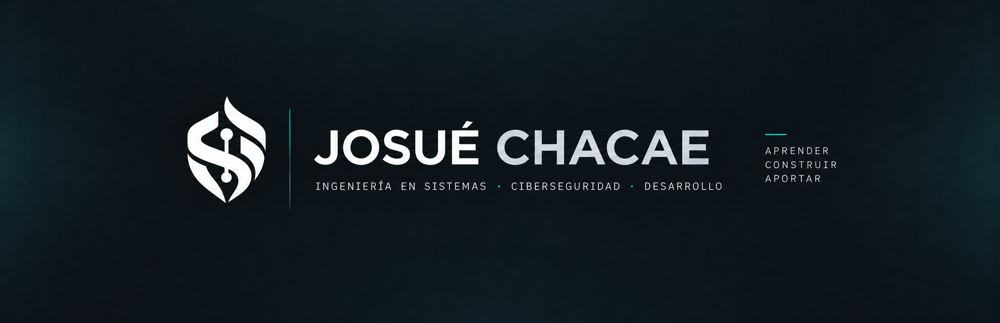

  

  Estudiante de Ingeniería en Sistemas con interés en ciberseguridad, desarrollo de software, soporte TI y tecnologías cloud.

  
  
  

---

## Perfil

Actualmente curso el **7.º semestre de Ingeniería en Sistemas** en la Universidad Autónoma Gabriel René Moreno, Facultad Integral del Chaco.

Mi formación e intereses abarcan distintas áreas de tecnología, especialmente **ciberseguridad, desarrollo de software, bases de datos, redes, soporte TI y cloud computing**.

Me interesa comprender cómo funcionan las tecnologías, aplicarlas en situaciones reales y seguir ampliando mi base técnica mediante proyectos académicos, personales y aprendizaje continuo.

---

## Tecnologías y herramientas

### Desarrollo

  
  
  
  
  
  

### Datos y modelado

  
  
  
  

### Sistemas y herramientas

  
  
  
  
  

---

## Proyectos destacados

<table>
<tr>
<td width="50%" valign="top">

### PassForge

Proyecto personal en Python que documenta la evolución de un generador básico de contraseñas hacia una versión más adecuada para seguridad utilizando `secrets`.

**Tecnologías**

`Python` · `Ciberseguridad` · `Código seguro`

[Ver repositorio](https://github.com/chacaejosue/pass-forge)

</td>
<td width="50%" valign="top">

### PPAC Simulator

Herramienta en Python que procesa el historial académico exportado en PDF y permite calcular y proyectar el Promedio Ponderado Acumulado por Créditos.

**Tecnologías**

`Python` · `PDF` · `Automatización`

[Ver repositorio](https://github.com/chacaejosue/ppac-simulador)

</td>
</tr>

<tr>
<td width="50%" valign="top">

### BodyIndex

Aplicación de consola para calcular y clasificar métricas como IMC, metabolismo basal y gasto energético estimado.

**Tecnologías**

`Python` · `CLI` · `Validación`

[Ver repositorio](https://github.com/chacaejosue/body-index)

</td>
<td width="50%" valign="top">

### Sistema de ventas

Prototipo académico orientado a la gestión comercial y financiera de emprendimientos independientes de venta por catálogo.

**Tecnologías**

`Laravel` · `SQL Server` · `Desarrollo web`

[Ver prototipo](https://github.com/chacaejosue/sistema-ventas)

</td>
</tr>
</table>

  <a href="https://josuechacae.dev">
    Ver más proyectos en josuechacae.dev
  </a>

---

## Actividad en GitHub

  
  

  
    Las estadísticas reflejan principalmente actividad y repositorios públicos y no representan por sí solas el nivel de dominio de cada tecnología.
  

---

## Formación complementaria

| Certificación | Emisor | Año |
|---|---|---:|
| Google Cybersecurity Professional Certificate | Google | 2026 |
| Scrum Master Certification | LearnQuest | 2026 |
| Google Digital Marketing & E-commerce Professional Certificate | Google | 2026 |

---

## Áreas de interés

`Ciberseguridad` · `Desarrollo de software` · `Cloud Computing` · `Soporte TI` · `Redes` · `Sistemas de información`

---

## Contacto

  <strong>Portafolio</strong> 
  <a href="https://josuechacae.dev">josuechacae.dev</a>

  <strong>LinkedIn</strong> 
  <a href="https://www.linkedin.com/in/chacae-josue">linkedin.com/in/chacae-josue</a>

  <strong>GitHub</strong> 
  <a href="https://github.com/chacaejosue">github.com/chacaejosue</a>

